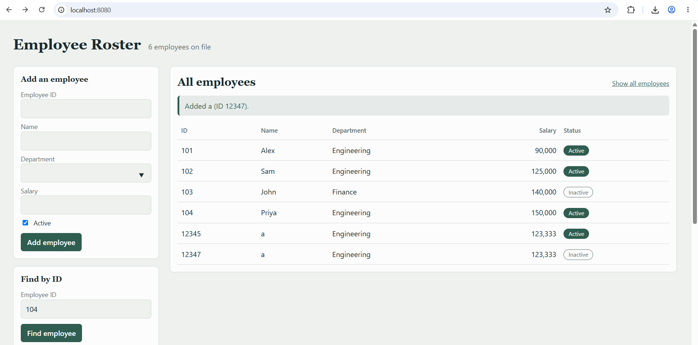
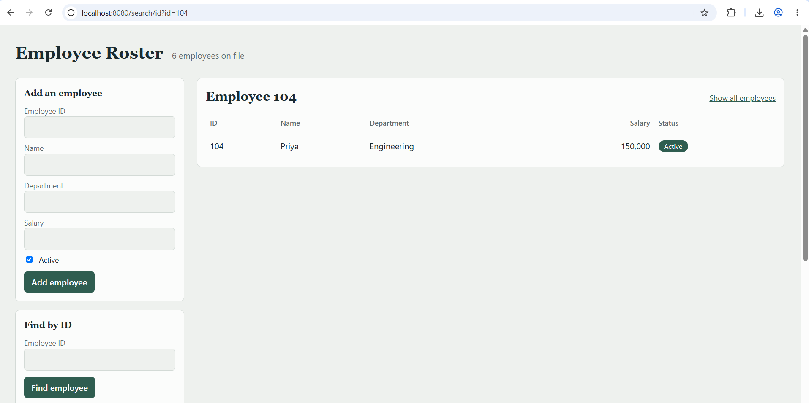

# Employee Management Console (Spring Boot)

A small application for managing employees, built with java. It keeps the requirements (Employee class, search, filters, custom exceptions, Stream API).

Data is held in memory and resets each time the app restarts. The four sample employees are loaded at startup.

## Features

| Requirement | Where to find it in the UI |
|---|---|
| Add employees | "Add an employee" form |
| Display all employees | Home page, or "Show all employees" |
| Search by Employee ID | "Find by ID" form |
| Employees in a department | "Show a department" form |
| Active employees with salary greater than a value | "Active employees by salary" form (default 100000 returns Priya and Sam) |
| Employee not found | Searching an unknown ID shows a clear error message |

## Prerequisites

- **JDK 17 or newer.** Check with `java -version`.
- **Maven 3.6 or newer.** Check with `mvn -version`. (Most IDEs bundle Maven, so this is optional if you use one.)

## How to run

### Option 1: Maven

```bash
cd employee-management
mvn spring-boot:run
```

### Option 2: Build a jar

```bash
cd employee-management
mvn clean package
java -jar target/employee-management-1.0.0.jar
```

### Open the app

Go to **http://localhost:8080**.

```
Active employees with salary > 100000:
102 | Sam    | Engineering  | 125,000 | Active
104 | Priya  | Engineering  | 150,000 | Active
```

To use another port: `mvn spring-boot:run -Dspring-boot.run.arguments=--server.port=9090`

## Screenshots



## Project structure

```
src/main/java/com/example/ems/
├── EmployeeManagementApplication.java   Entry point
├── model/Employee.java                  Entity with private fields and getters/setters
├── exception/                           EmployeeException (base), EmployeeNotFoundException,
│                                        DuplicateEmployeeException, InvalidEmployeeException
├── repository/
│   ├── EmployeeRepository.java          Interface (abstraction)
│   └── InMemoryEmployeeRepository.java  Map-based implementation
├── service/EmployeeService.java         Business rules, validation, Stream filters
├── controller/EmployeeController.java   Handles web requests and shows errors
└── config/DataLoader.java               Loads sample data, prints console output
src/main/resources/templates/index.html  The single-page UI
src/test/java/.../EmployeeServiceTest.java
```
